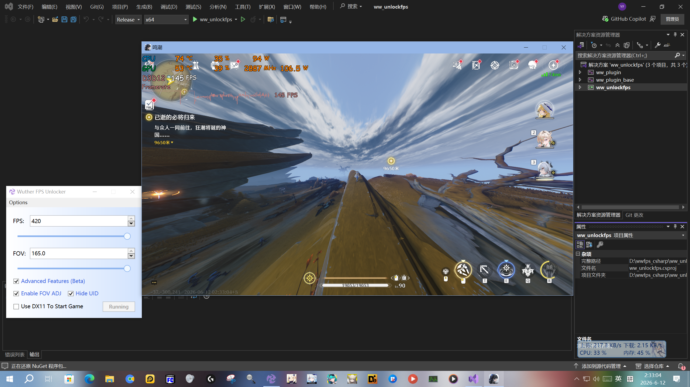

# Wuther FPS Unlocker

鸣潮(Wuthering Waves) FPS解锁工具，支持帧率解锁、FOV调整、隐藏UID等功能。

## 功能

- **FPS解锁** (0-420)
- **FOV调整** (15-165)
- **隐藏游戏UID**
- **DX11启动**
- **省电模式** - 游戏失焦时自动降至15帧
- **进程优先级控制**
- **自动启动** - 跳过GUI直接启动
- **托盘最小化**
- **配置自动保存** (ww_fps_config.ini)

## 软件界面

## 构建

- Visual Studio 2022 + .NET 8.0 SDK
- 打开 `ww_unlockfps.sln`，**Release | x64** 编译

## 使用

1. 运行 `ww_unlockfps.exe`
2. **Options > Setup** 选择游戏EXE
3. 设置FPS值，点击 **Start Game**

## 作者

[Bilibili](https://space.bilibili.com/456492426)
